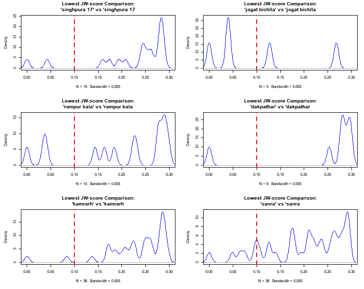

---
output:
  xaringan::moon_reader:
    seal: true
    lib_dir: libs
    css: ["default", "my-theme.css", "animate.css"]
    nature:
      highlightStyle: github
      beforeInit: "https://platform.twitter.com/widgets.js"
      highlightLines: true
      highlightSpans: true
      ratio: 16:9
      countIncrementalSlides: true
      slideNumberFormat: "%current%/%total%"
---


name: title_slide
class: middle, title-slide, animated, fadeIn, faster

<div class="my-footer"></div>

.titleslide-title[(Data Cleaning + Fuzzy Matching) in R]

<br>
### .title-font[Data Cleaning Brown Bag]
####.title-font[Faculty of Information (iSchool) at University of Toronto]

<br>
### <b> .title-font[Eugene Joh] </b>
.title-font[*February 28 2020*]
<br>

<!-- <h4><i class="fab fa-github fa-lg">&nbsp;</i> <i class="fab fa-twitter fa-lg"></i> .title-font[[&nbsp;@eugejoh](https://twitter.com/eugejoh)] -->

<div class = "my-footer"><span>Disclaimer: views and opinions expressed here are my own and do not represent my employer</div>


???

---
name: intro
class: animated, fadeIn, faster

.pull-left[  
# Outline

  - Challenges with global health datasets
  - Geocoding locations using R  
    - Cleaning messy text  
    - Fuzzy matching  
    - Iteration  
  - Takeaways
]

.pull-right[
<br>
```{r echo=FALSE, out.width = "100", fig.align='center'}
knitr::include_graphics("https://cdn.onlinewebfonts.com/svg/img_385487.png")
```
<br>
```{r echo=FALSE, out.width = "120px", fig.align='center'}
knitr::include_graphics("https://upload.wikimedia.org/wikipedia/commons/thumb/1/1b/R_logo.svg/724px-R_logo.svg.png")
```
<br>
```{r echo=FALSE, out.width = "170px", fig.align='center', }
knitr::include_graphics("https://www.traillink.com/images/tl/custom-icons/new-map-icon.svg")
```
]

???
Today I’ll be talking about some challenges that I’ve come to identify with commonly used global health datasets, then I’ll provide a walkthrough or case study on a project I was involved with this past summer where we had to geocode villages and towns in India. I’ll demonstrate about how I used R to tackle this project, breaking it down into 3 sections – I’ll be showing some code and examples of the steps involved.
And then I’ll finish with a couple lessons learned and takeways from this project, that I hope will be useful or at least interesting for those here today.


---
name: tweet
class: animated, fadeIn, faster

<center>
<blockquote class="twitter-tweet" width="300" data-lang="en"><p lang="en" dir="ltr"><a href="https://twitter.com/causalinf/status/1230146663207096320">19, February 2020</a></blockquote>
</center>

???

---
name: globalhealthtitle
class: title-slide, middle, animated, fadeIn, faster

# Challenges with Cleaning Global Health Data

???

---
name: ghdata
class: animated, fadeIn, faster

# Global Health

*"improving the health of populations at the international level"*

.pull-left[
**Health Surveys**  
 - Sample-based
 - Nested in vital statistics  
 - Household-level information
 - E.g. malaria, HIV, maternal & child health, malnutrition, etc.
]

.pull-right[
```{r echo=FALSE, out.width=350}
knitr::include_graphics("https://2oqz471sa19h3vbwa53m33yj-wpengine.netdna-ssl.com/wp-content/uploads/2017/09/681viwphrfnz-1.gif")
```
]


???
So just at a high-level global health is the study of population health, at the global or international level. A lot of this work is focused in lower-middle income countries, countries with less resources and infrastructure we take for granted in countries like here in Canada.

A lot of the data generated and used in the area of global health is related to activity of governments and international organizations (like the WHO, USAID) – they are usually built on existing census programs that capture information like birth rates, mortality, sex ratios, etc.

These surveys are usually sample-based or based on a sample design, they typically capture information down to the household-level, and focus on specific causes of disease burden, overall-health, and vulnerable groups


---
name: commonchallenges
class: animated, fadeIn, faster


# Common Data Challenges

.pull-left50[

- Data collection -> entry errors  
- Missing/incomplete data  
- Ambiguity due to...
  - Alternative/inconsistent spelling 
  - Multiple languages
  ]
--

.pull-right50[

```{r collapse=FALSE, eval=FALSE}
# I know what this means
"doughnut"
"donut"

# Hmmm... Google please help me
"Gothra" #a village?
"Gotra"  #a clan or lineage? maybe a village?

"Kaipukharia" #a village
"Kaipukuria"  #also a village, k
"Kaipukhuria" #and also a village..?
```

]

???

data collection, especially when using paper forms is problematic with data entry. also speaks to the training of those writing down names, transcribing the written text into a computer, there so much room for error

---
name: geocodingtitle
class: title-slide, middle, animated, fadeIn, faster

# Geocoding Locations using R

???

---
name: projectdescr
class: animated, fadeIn, faster

# Project Description
**Objective**
 - Assign latitude/longitude to survey sampling units

**Data Sources**
 - Sampling units master list
 - Village amenities
 - Town amenities

???

---
name: pic1
class: animated, fadeIn, faster
<br>
```{r echo=FALSE}
DiagrammeR::grViz('digraph {
graph [rankdir = LR]
node [shape = rectangle, fontsize = "22", style = filled, fillcolor = Linen, fontname = "Arial", shape = "tab" fontcolor = "gray10"]

   sample [ label=<
     <table border="0" cellborder="0" cellspacing="1">
       <tr><td align="left"><b>Sampling Units         </b></td></tr>
       <tr><td align="left"><font point-size="15"> n = 9,000</font></td></tr>
       <tr><td align="left"><font point-size="15"> - Sampling Unit ID</font></td></tr>
       <tr><td align="left"><font point-size="15"><b> - Village Names</b></font></td></tr>
       <tr><td align="left"><font point-size="15"><b> - Town Names</b></font></td></tr>
<tr><td align="left"><font point-size="15"> - Admin Levels</font></td></tr>
<tr><td align="left"> </td></tr>
<tr><td align="left"> </td></tr>
<tr><td align="left"> </td></tr>
<tr><td align="left"> </td></tr>
<tr><td align="left"> </td></tr>
<tr><td align="left"> </td></tr>
     </table>>]

   vill [ label=<
     <table border="0" cellborder="0" cellspacing="1">
       <tr><td align="left"><b>Village Amenities         </b></td></tr>
       <tr><td align="left"><font point-size="15"> n = 640,000</font></td></tr>
       <tr><td align="left"><font point-size="15"><b> - Village Names</b></font></td></tr>
       <tr><td align="left"><font point-size="15" color = "black"> - Latitude and Longitude</font></td></tr>
<tr><td align="left"><font point-size="15"> - Admin Levels</font></td></tr>
       <tr><td align="left"> </td></tr>
     </table>>, shape = cylinder, fillcolor = lightsteelblue1]

   twn [ label=<
     <table border="0" cellborder="0" cellspacing="1">
       <tr><td align="left"><b>Town Amenities         </b></td></tr>
       <tr><td align="left"><font point-size="15"> n = 8,000</font></td></tr>
       <tr><td align="left"><font point-size="15"><b> - Town Names</b></font></td></tr>
       <tr><td align="left"><font point-size="15" color = "black"> - Latitude and Longitude</font></td></tr>
<tr><td align="left"><font point-size="15"> - Admin Levels</font></td></tr>
       <tr><td align="left"> </td></tr>
     </table>>, shape = cylinder, fillcolor = lightsteelblue1]

sample -> {vill twn} [arrowhead=none]

}', width = 650, height = 500)
```

---
name: pic2
class: animated, fadeIn, faster
```{r echo=FALSE}
DiagrammeR::grViz('digraph {
graph [rankdir = LR]
node [shape = rectangle, fontsize = "22", style = filled, fillcolor = Linen, fontname = "Arial", shape = "tab" fontcolor = "gray10"]

  # survey [ label=<
  #  <table border="0" cellborder="0" cellspacing="1">
  #    <tr><td align="left"><b>Survey Forms         </b></td></tr>
  #    <tr><td align="left"><font point-size="15"><b> - Sampling Unit ID</b></font></td></tr>
  #    <tr><td align="left"><font point-size="15"> - Household Information</font></td></tr>
  #    <tr><td align="left"><font point-size="15"> - Village Names</font></td></tr>
  #    <tr><td align="left"><font point-size="15"> - Town Names</font></td></tr>
  #    <tr><td align="left"> </td></tr>
  #    <tr><td align="left"> </td></tr>
  # </table>>]

   sample [ label=<
     <table border="0" cellborder="0" cellspacing="1">
       <tr><td align="left"><b>Sampling Units         </b></td></tr>
<tr><td align="left"><font point-size="15"> n = 9,000</font></td></tr>
       <tr><td align="left"><font point-size="15"><b> - Sampling Unit ID</b></font></td></tr>
       <tr><td align="left"><font point-size="15"> - Village Names</font></td></tr>
       <tr><td align="left"><font point-size="15"> - Town Names</font></td></tr>
<tr><td align="left"><font point-size="15"> - Admin Levels</font></td></tr>
<tr><td align="left"> </td></tr>
<tr><td align="left"> </td></tr>
<tr><td align="left"> </td></tr>
<tr><td align="left"> </td></tr>
<tr><td align="left"> </td></tr>
<tr><td align="left"> </td></tr>
     </table>>]

   vill [ label=<
     <table border="0" cellborder="0" cellspacing="1">
       <tr><td align="left"><b>Village Amenities         </b></td></tr>
<tr><td align="left"><font point-size="15"> n = 640,000</font></td></tr>
       <tr><td align="left"><font point-size="15"> - Village Names</font></td></tr>
       <tr><td align="left"><font point-size="15" color = "black"><b> - Latitude and Longitude</b></font></td></tr>
<tr><td align="left"><font point-size="15"> - Admin Levels</font></td></tr>
       <tr><td align="left"> </td></tr>
     </table>>, shape = cylinder, fillcolor = lightsteelblue1]

   twn [ label=<
     <table border="0" cellborder="0" cellspacing="1">
       <tr><td align="left"><b>Town Amenities         </b></td></tr>
<tr><td align="left"><font point-size="15"> n = 8,000</font></td></tr>
       <tr><td align="left"><font point-size="15"> - Town Names</font></td></tr>
       <tr><td align="left"><font point-size="15" color = "black"><b> - Latitude and Longitude</b></font></td></tr>
<tr><td align="left"><font point-size="15"> - Admin Levels</font></td></tr>
       <tr><td align="left"> </td></tr>
     </table>>, shape = cylinder, fillcolor = lightsteelblue1]

   out [ label=<
     <table border="0" cellborder="0" cellspacing="1">
       <tr><td align="left"><b>Desired Output         </b></td></tr>
<tr><td align="left"><font point-size="15"> n = ??? </font></td></tr>
       <tr><td align="left"><font point-size="15"> - <b>Sampling Unit ID</b></font></td></tr>
       <tr><td align="left"><font point-size="15" color = "black"> - <b>Latitude and Longitude</b></font></td></tr>
       <tr><td align="left"> </td></tr>
     </table>>, shape = cylinder, fillcolor = skyblue2]

# survey -> sample 
sample -> {vill twn} [arrowhead=none]
{sample vill twn} -> out
}', width = 1000, height = 500)
```

???
villages - 640948
towns - 7948


---
name: probs
class: animated, fadeIn, faster

.pull-left[
# Problem(s)

**No foreign key for consistent joins...**

Village/town name variable  
 - Messy text (case, symbols, spaces)
 - Alternative spelling
 - True value vs. data entry error
]

--

.pull-right[

<br>
<br>
```{r eval=FALSE}
# how do I join on this?
"Basaimeo(149)"
"1 Ffb"
"Hoogrijan T.E.116/64 & 66 Nlr"
"Lingzey (Assam)$"
"(5 K.M. dairy Mill Tinkengsung)"
" Panipat (M Cl + OG)"
"12 Miles It Road"
"Wagon Pathar IV (Maanbasti )"
"Vadiyavalasa @ Vaddevalasa"
"MEGHANA"
"(Maithong II/(Namphai II)"
  
# the same location?
"Kanakpur Pt. II (CT)"
" Kanakpur Pt Ii"
"Kanakpur Ii"

# is this entry error?
"Baniakuri"
"Banjakuri"
```

]

???
so we were left with joining these data sources together by village and town name (we did not have a foreign key like a village or town code we could use)
Compounding this problem, was that issues I described earlier were very prevalent in these location name columns/variables

---
name: precedent
class: animated, fadeIn, faster
exclude: false

.pull-left[

# What Precedent Existed?

**SQL Queries**
 - Standardize names (letter case)
 - Basic text cleaning (removing spaces)
 - Joins on "cleaned" variable
 - Nearest-Neighbour search

]

.pull-right[
<br>
```{r echo=FALSE, out.width=220, fig.align='center'}
knitr::include_graphics("https://wiki.postgresql.org/images/thumb/a/a4/PostgreSQL_logo.3colors.svg/540px-PostgreSQL_logo.3colors.svg.png")
```
<br>
```{r echo=FALSE, out.width=150, fig.align='center'}
knitr::include_graphics("https://www.osgeo.org/wp-content/uploads/postgis-logo-171x250.png")
```

]

???

---
name: rtitle
class: title-slide, middle, animated, fadeIn, faster

## How should we tackle this problem?

???

---
name: rtoolkit
class: animated, fadeIn, faster

.pull-left[
# R Packages
 - Database Connection
    - `DBI`
    - `RPostgres`
 - Cleaning, Processing, and Joins
    - `stringr`
    - `dplyr`
 - Fuzzy Matching
    - `stringdist`
 - Iteration
    - `purrr`

]

.pull-right[
<br>
```{r echo=FALSE, out.width=140, fig.align='center'}
 
knitr::include_graphics("img/dplyr.svg")   
knitr::include_graphics("img/purrr.svg")  
```

]

???


---
name: cleantext
class: animated, fadeIn, faster

# Cleaning Text
```{r include=FALSE}
library(tidyverse)
library(stringdist)
my_data <- tibble::tibble(
  vilname = c(
    "Basaimeo(149)",
    "Hoogrijan T.E.116/64 & 66 Nlr",
    "(5 K.M. dairy Mill Tinkengsung)",
    "Wagon Pathar IV (Maanbasti )",
    "Vadiyavalasa @ Vaddevalasa",
    " MEGHANA"
  )
) %>% mutate(id = paste0(0, row_number())) %>% select(id, vilname)
my_data_original <- my_data
```
.pull-left[
Village and Town Names

 - Remove punctuation
 - Trim white space (leading and trailing)
 - Remove extra spaces
 - Convert to lowercase

]

.pull-right[

```{r}
my_data
```

]


---
name: rmpunct
class: animated, fadeIn, faster

# Remove Punctuation

.s80[`stringr::str_replace_all()` replaces all matches]

```{r}
my_data$vilname <- str_replace_all(my_data$vilname, "[[:punct:]]+", "")
```
--
```{r echo=FALSE}
my_data
```


???


---
name: rmextraspaces 
class: animated, fadeIn, faster

# Remove White Space

.s80[`stringr::str_trim()` to trim white space]  
.s80[`stringr::str_replace_all()` replaces many spaces with just one]

```{r}
my_data$vilname <- str_trim(my_data$vilname, "both")
my_data$vilname <- str_replace_all(my_data$vilname, "[[:space:]]+", " ")
```
--
```{r echo=FALSE}
my_data
```

???
str_replace_all(my_data$vilname, "[[:space:]]+", " ") doesnt remove leading spaces

---
name: tolower
class: animated, fadeIn, faster

# Convert to Lower Case

.s80[`tolower()` to convert everything to lower-case]
```{r}
my_data$vilname <- tolower(my_data$vilname)
```
--
.pull-left50[
```{r}
my_data_original #original
```
]

.pull-right50[
```{r}
my_data #cleaned-ish!
```

]

???

---
name: fncver
class: animated, fadeIn, faster

# Make a Function

Put all the steps in a function, then clean all `character` type columns

.pull-left50[
```{r}
my_cleaner <- function(x) {
  x %>% 
    str_replace_all("[[:punct:]]+", "") %>% 
    str_trim(side = "both") %>% 
    str_replace_all("\\s+", " ") %>% 
    tolower()
}
```
]

.pull-right50[

```{r}
my_data %>% 
  mutate_if(is.character, my_cleaner)
```

]


???

---
name: titlestringdist
class: title-slide, middle, animated, fadeIn, faster

## ...but can we really use this 'cleaned' variable?

???

---
name: fuzzymatch
class: animated, fadeIn, faster

# Fuzzy Matching

*"finding an approximate match, not exact"*

**String Distance**
 - Metric that measures the asimilarity or difference between two strings
 - Levenshtein Distance, Cosine Similarity, Jaro-Winkler, etc.
 - Lower number -> better match
 - [`stringdist`](https://github.com/markvanderloo/stringdist) R package 

--

```{r echo = FALSE, out.width=190, fig.align='left'}
knitr::include_graphics("https://media.giphy.com/media/CgKFTMMFDESNW/giphy.gif")
```

---
name: stringdist
class: animated, fadeIn, faster

# String Distance

```{r}
# more donuts
a <- "donut"
b <- c("donut", "dounut", "doughnut", "tunod")
```
--
```{r}
stringdist(a, b, method = "lv") # Levenshtein Distance
stringdist(a, b, method = "cos") # Cosine Similarity
stringdist(a, b, method = "jw") # Jaro-Winkler
```

???


---
name: stringdistindia
class: animated, fadeIn, faster

# Village Names

Compare `"kanakapur II"` to names in `c1` and `c1a`.

```{r include=FALSE}
c1 <- c("Kanakpur Pt. II (CT)", " Kanakpur Pt Ii", "Kanakpur Ii")
  
my_data2 <- tibble(
  c1,
  c1a = my_cleaner(c1),
  c2 = c("kanakapur II")
)

mutate_stringdist <- function(x, a, b, method, rev = FALSE) {
  A <- sym(a); B <- sym(b)
  mutate(
    x, !!paste(method, a, b, sep = "_") := 
      stringdist(!!A, !!B, method = method, p = 0.2)
    )
}
```

```{r}
my_data2
```
--

```r
mutate_stringdist <- function(x, a, b, method, rev = FALSE) {
  A <- sym(a); B <- sym(b)
  mutate(
    x, !!paste(method, a, b, sep = "_") := 
*      stringdist(!!A, !!B, method = method, p = 0.2)
    )
}
```

---
name: stringdistindia
class: animated, fadeIn, faster

# Village Names
```{r}
my_data2_match <- my_data2 %>%
  mutate_stringdist("c1", "c2", method = "jw") %>% 
  mutate_stringdist("c1a", "c2", method = "jw") %>% 
  arrange_at(vars(matches("jw")))
```
--
```{r echo=FALSE}
my_data2_match
```

---
name: purrr
class: animated, fadeIn, faster

# Iteration

In each data source "block" by state, district, substrict:
 - Compute string distance for village/town names using `stringdist()`  
 - Filter metric by a match threshold `jw < 0.1`

--

```r
# block no matches in village amenities table by admin levels
vil_no_matches_list <- vil_no_matches %>% 
  dplyr::group_split(state_code14, dist_code, subdist_code) 

# same for sample units table
srs_no_matches_list <-vil_no_matches %>% 
  dplyr::group_split(state_code14, dist_code, subdist_code) 

#loop through each block, calculate string distance, filter based on string distance metric
*purrr::map2(
  vil_no_matches_list, 
  srs_no_matches_list, 
  function(...) my_stringdist(...) %>% filter(jw < 0.1) #wrapper function around `stringdist()`
  ) 
```

???
36 states 
655 districts
5000 subdistricts

---
name: stringdistplot
class: animated, fadeIn, faster

# Output
.pull-left50[
 - After cleaning and fuzzy matching:
   - Villages **~96%** match
   - Towns: **~94%** match
- Automation of SQL queries via `DBI`
- Reduced manual matching!!!
]


.pull-right50[

```{r, echo=FALSE, out.width=850, fig.align='center'}

```

]
???
still have to manually review 15,000 records but better than 42,000

---
name: takeaway
class: animated, fadeIn, faster

# Closing Thoughts
.pull-left[
 - R is great at cleaning messy text
- Prioritize comprehensive cleaning
- Fuzzy matching is useful (w/caveats)
- Leverage existing work

]

--
.pull-right[
```{r echo=FALSE}
knitr::include_graphics("https://github.com/allisonhorst/stats-illustrations/raw/master/rstats-artwork/code_hero_rstats.png")
```
.tiny[https://github.com/allisonhorst/stats-illustrations]
]

---
name: lastslide
class: bottom, center, animated, fadeIn, faster
<link rel="stylesheet" href="https://use.fontawesome.com/releases/v5.7.2/css/all.css" integrity="sha384-fnmOCqbTlWIlj8LyTjo7mOUStjsKC4pOpQbqyi7RrhN7udi9RwhKkMHpvLbHG9Sr" crossorigin="anonymous">

# Thank you!
<br>
<h4><i class="fab fa-github fa-lg"></i> <i class="fab fa-twitter fa-lg"></i>.title-font[&nbsp;@eugejoh]</h4>

.small[[Slides](https://github.com/eugejoh/datacleaning-brownbag)]

<br>
<br>
<br>
.tiny[Created via the R package [xaringan](https://github.com/yihui/xaringan)]
